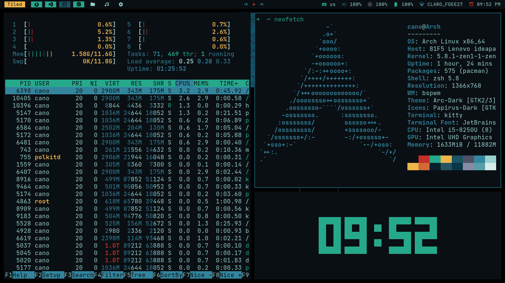

# Note  
I use Some scripts for the distro ArchCraft, the files contain the mentions to the author [adi1090x](https://github.com/adi1090x) 

# Dotfiles & Configs  

Check the [keybindings](https://github.com/PAC97/dotfiles#Keybindings) and the
[software](https://github.com/PAC97/dotfiles#Software) for to use the dotfiles

## BSPWM


# Keybindings

## Windows

| Key                                           | Action                                                |
|-----------------------------------------------|-------------------------------------------------------|
| **super + f**                                 | fullscreen                                            |
| **super + p**                                 | pseudo tiled                                          |
| **super + t**                                 | tiled                                                 |
| **super + space**                             | alternate floating and tiled                          |
| **super + {h,v,c}**                           | split horizontal,vertical,cancel                      |
| **super + ctrl + {1-9}**                      | Preselect the ratio                                   |
| **super + shift + {up,down,left,right}**      | move window up,down,left,right                        |
| **alt + shift + tab**                         | Change focus to next window, including floating window|
| **ctrl + alt + {Left, Right}**                | Switch workspace                                      |
| **super + {Tab,grave}**                       | Switch to last opened workspace                       |
| **super + shift + {1,8}**                     | Send focused window to another workspace              |
| **super + control + {Left,Right,Up,Down}**    | Expanding Floating Window                             |
| **super + alt + {Left,Right,Up,Down}**        | Shrinking Floating Window                             |
| **control + shift + {Left,Down,Up,Right}**    | Move floating windows                                 |
| **sctrl + alt + {q,r}**                       | Quit/Restart bspwm                                    |
| **super + w**                                 | Close App                                             |
| **ctrl + alt + Escape**                       | Kill                                                  |
| **super + Escape**                            | Reload Keybindings                                    | 

## Apps

| Key                        | Action                       |
|----------------------------|------------------------------|
| **super + d**              | Rofi Launcher                 |
| **super + shift + f**      | launch pcmanfm                |
| **super + shift + b**      | launch firefox                |
| **super + shift + g**      | launch geany                  |
| **super + shift + d**      | neovim                        |
| **super + shift + p**      | ncmpcpp + cava                |
| **super + return**         | kitty (terminal)              |
| **super + shift + return** | kitty (terminal) floating     |
| **super + shift + w**      | Rofi Open Windows             |
| **super + shift + m**      | Music Controller              |
| **super + shift + r**      | Root apps                     |
| **super + shift + x**      | Power Menu                    |
| **super + shift + n**      | Open/Close Notification Center|
| **ctrl + alt + s**         | Screenshot Menu               |
| **ctrl + alt + n**         | Network Menu                  |
| **ctrl + alt + t**         | Themes Menu                   |
| **ctrl + alt + l**         | LockScreen                    |
| **PrintSc**                | Take a screenshot             |
| **alt + PrintSc**          | Take a screenshot in 5 second |

# Software

| Software                      | Fonts                        |
|-------------------------------|------------------------------|
| **bspwm**                     | **JetBrains Mono**           |              
| **sxhkd**                     | **JetBrains Mono Hack Nerd** |              
| **rofi**                      | **Meterial Icons**           |              
| **polybar**                   | **Iosevka**                  |              
| **mpd**                       | **Feather**                  |
| **mpc**                       | **Siji**                     |              
| **ncmpcpp**                   | **Iosevka Nerd Font**        |              
| **ncmpcpp-ueberzug**          | **Waffle**                   |              
| **alsa-tools**                |                              |          
| **alsa-utils**                |                              |              
| **alsa-plugins**              |                              |              
| **pulseaudio**                |                              |              
| **pulseaudio-alsa**           |                              |              
| **scrot**                     |                              |        
| **viewnior**                  |                              |            
| **xorg-xbacklight**           |                              |              
| **deadd-notification-center** |                              |              
| **neovim**                    |                              |              
| **firefox**                   |                              |              
| **geany**                     |                              |              
| **ranger**                    |                              |
| **dunst**                     |                              |  
| **lxappearance**              |                              |
| **picom-tryone**              |                              |
| **networkmanager-dmenu**      |                              |  
| **networkmanager**            |                              |
| **wpa_supplicant**            |                              |    
| **dialog**                    |                              |
| **nm-connection-editor**      |                              |  
| **arc-gtk-theme**             |                              |    
| **papirus-icon-theme**        |                              | 

# Installation
```
sudo pacman -S bspwm sxhkd rofi mpd mpc ncmpcpp alsa-tools alsa-utils alsa-plugins pulseaudio pulseaudio-alsa scrot viewnior xorg-xbacklight neovim firefox geany ranger dunst lxappearance networkmanager wpa_supplicant dialog nm-connection-editor arc-gtk-theme papirus-icon-theme
```
```
git clone https://aur.archlinux.org/polybar.git  
cd polybar  
makepkg -si 
``` 
```
yay -S picom-tryone-git networkmanager-dmenu-git deadd-notification-center-bin betterlockscreen-git 
```

## Deadd Notification Center Dependences 
```
pip install notify-send.py
```

## ncmpcpp-ueberzug Dependences 
Install [ueberzug](https://github.com/seebye/ueberzug). If you already have python and pip:

```
$ sudo pip3 install ueberzug
``` 

## Install Dotfiles 
``` 
git clone https://github.com/PAC97/dotfiles.git  
cd dotfiles  
cp -r .config/* ~/.config  
cp -r fonts/* ~/.local/share/fonts  
sudo cp bin/* /usr/local/bin  
cp -r .Xresources.d ~/  
cp .Xresources ~/  
cp .fehbg ~/  
cp -r .mpd ~/  
cp -r .ncmpcpp ~/  
```  